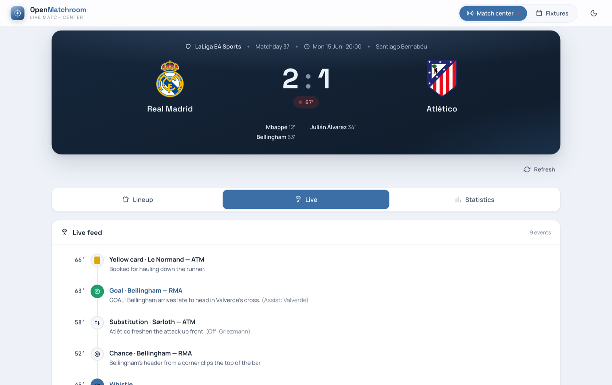

<div align="center">

# ⚽ OpenMatchroom

**An open-source, white-label live football match-center.**

Lineups, live commentary and match stats in one screen — with a simple admin to run it all.
Drop in your colours and crest, self-host it, own the data.

[**▶️ Live demo**](https://open-matchroom.profil-software.com/demo) &nbsp;·&nbsp; [**🌐 Landing page**](https://open-matchroom.profil-software.com/) &nbsp;·&nbsp; [**📖 Contributor guide**](./AGENTS.md)

[](https://github.com/profilsoftware/open-matchroom/actions/workflows/ci.yml)
&nbsp;[](https://codecov.io/gh/profilsoftware/open-matchroom)
&nbsp;[](./LICENSE)
&nbsp;
&nbsp;
&nbsp;
&nbsp;

<a href="https://open-matchroom.profil-software.com/demo">
  
</a>

<sub>The live match center — scoreboard, Lineup / Live timeline / Statistics tabs, updated from the admin live console.</sub>

</div>

---

OpenMatchroom ships as **two apps that talk over a REST API** — a public **match center**
(scoreboard + Lineup / Live timeline / Statistics tabs) with a fixtures schedule, and a gated
**admin** for managing teams, squads, fixtures, lineups, a live console, and statistics. The
**white-label** brand — colours, crest, theme and font — is set per deploy.

> **▶️ Try the [live demo](https://open-matchroom.profil-software.com/demo).** There's also a
> [landing page](https://open-matchroom.profil-software.com/) that showcases the product.

---

## Contents

- [Stack](#stack)
- [Prerequisites](#prerequisites)
- [Quick start](#quick-start)
- [What `make up` does](#what-make-up-does)
- [URLs](#urls)
- [Signing in to the admin](#signing-in-to-the-admin)
- [Seeding demo data](#seeding-demo-data)
- [Creating / changing the admin](#creating--changing-the-admin)
- [Everyday commands](#everyday-commands)
- [Configuration](#configuration)
  - [Backend env](#backend-env)
  - [Frontend env & white-label theming](#frontend-env--white-label-theming)
- [Resetting the database](#resetting-the-database)
- [Running the tests](#running-the-tests)
- [Project layout](#project-layout)
- [Troubleshooting](#troubleshooting)
- [Production](#production)
- [License](#license)

---

## Stack

- **Backend** — Django 6 + Django REST Framework on PostgreSQL. Cookie-based JWT auth. Lean by
  design: no Celery/Redis broker in dev, local cache is in-memory. Python 3.14, managed with `uv`.
- **Frontend** — Next.js 16 + React 19 + Tailwind v4. Node 22, managed with `pnpm`.
- **Dev orchestration** — Docker Compose (`postgres` + `backend` + `frontend`), driven by a
  `Makefile`.

You do **not** need Python, Node, `uv` or `pnpm` installed on your machine — everything runs in
containers. You only need Docker and `make`.

---

## Prerequisites

- **Docker** + **Docker Compose** (Docker Desktop on macOS/Windows includes both).
- **`make`** (pre-installed on macOS/Linux; on Windows use WSL or run the `docker compose`
  commands directly — see [Everyday commands](#everyday-commands)).

Make sure ports **3000** (frontend), **8000** (backend) and **5432** (Postgres, internal) are free.

---

## Quick start

```bash
git clone <this-repo> open-matchroom
cd open-matchroom

make up      # build + start postgres, backend, frontend (first run pulls images & builds — give it a few minutes)
make seed    # in a second terminal, once the stack is up: load demo data (4 clubs + fixtures)
```

Then open:

- **Public site** → http://localhost:3000
- **Admin** → http://localhost:3000/admin/login

That's it. The database is migrated and a default admin is created automatically on `make up`
(details below); demo content is the only thing you have to load yourself with `make seed`.

> The committed local env files (`backend/.envs/.local/*`) ship with working demo credentials, so
> the stack runs out of the box with no manual `.env` setup.

---

## What `make up` does

`make up` runs `docker compose up --build`, which starts three services:

| Service | Image | Role |
| --- | --- | --- |
| `postgres` | `openmatchroom_production_postgres` | PostgreSQL 18 with a persistent volume |
| `backend` | `openmatchroom_local_backend` | Django dev server on `:8000` |
| `frontend` | `openmatchroom_local_frontend` | Next.js dev server on `:3000` |

On startup the **backend** container runs its `/start` script, which:

1. applies database migrations (`manage.py migrate`),
2. idempotently creates the default admin (`manage.py createadmin`),
3. starts the dev server (`runserver 0.0.0.0:8000`).

So a fresh `make up` gives you a migrated database and a ready-to-use admin account. Source files
are bind-mounted, so edits on the host hot-reload in both apps.

> **Demo content is _not_ loaded automatically** — run [`make seed`](#seeding-demo-data) for that.

---

## URLs

| What | URL |
| --- | --- |
| Public match center | http://localhost:3000 |
| Admin panel (app login) | http://localhost:3000/admin/login |
| API root | http://localhost:8000/api/ |
| API docs (Swagger UI) | http://localhost:8000/api/docs/ |
| OpenAPI schema (raw) | http://localhost:8000/api/schema/ |
| Django admin (low-level) | http://localhost:8000/admin/ |

The app admin at `/admin/login` is the intended way to manage content. The Django admin at
`:8000/admin/` is the framework's built-in admin — handy for poking at raw rows.

---

## Signing in to the admin

The default admin is created for you on `make up`. Use these local demo credentials:

| Field | Value |
| --- | --- |
| Email | `admin@club.example` |
| Password | `matchroom-admin` |

These come from `backend/.envs/.local/.django` (`DJANGO_ADMIN_EMAIL` / `DJANGO_ADMIN_PASSWORD` /
`DJANGO_ADMIN_NAME`). The same account works for both the app admin (`:3000/admin/login`) and the
Django admin (`:8000/admin/`).

---

## Seeding demo data

```bash
make seed
```

This runs `manage.py seed_demo` and loads white-label demo content.

The seed is **idempotent**: clubs/players are upserted on natural keys and each match's child rows
(events, stats, lineup) are rebuilt from scratch, so you can re-run it any time without piling up
duplicates. Goal/penalty events replay through the same service the live console uses, so the
stored scoreline is built up exactly as it would be in production.

Run it after the stack is up. To wipe everything and start clean, see
[Resetting the database](#resetting-the-database).

---

## Creating / changing the admin

The default admin is enough for local work, but here are the options.

**Change the default credentials.** Edit `backend/.envs/.local/.django`:

```dotenv
DJANGO_ADMIN_EMAIL=you@example.com
DJANGO_ADMIN_PASSWORD=choose-a-password
DJANGO_ADMIN_NAME=Your Name
```

then re-create the admin (the `createadmin` command is idempotent and **only sets the password on
first creation**, so it never clobbers a password you've already changed — to apply new creds to an
existing email you'll need to reset it, e.g. via the Django admin or `changepassword` below):

```bash
docker compose run --rm backend python manage.py createadmin
```

**Create an extra superuser interactively** (Django's built-in command):

```bash
docker compose run --rm backend python manage.py createsuperuser
```

**Reset an existing user's password:**

```bash
docker compose run --rm backend python manage.py changepassword you@example.com
```

> `make up` re-runs `createadmin` on every start, but because it's idempotent that's a no-op once
> the admin exists — it won't reset your password.

---

## Everyday commands

All of these are thin wrappers over `docker compose`. Run `make help` for the live list.

| Command | What it does |
| --- | --- |
| `make up` | Build + start postgres, backend, frontend (foreground; `Ctrl-C` to stop). |
| `make down` | Stop and remove the containers. |
| `make prune` | Stop containers **and delete their volumes** (a full DB reset). |
| `make logs` | Follow container logs. |
| `make seed` | Load the demo data (run after `make up`). |
| `make test` | Run the backend test suite (`pytest`). |
| `make manage ARGS="…"` | Run any `manage.py` command, e.g. `make manage ARGS="showmigrations"`. |
| `make migrate` | Apply database migrations. |
| `make makemigrations` | Generate new migrations after model changes. |
| `make shell` | Open a `bash` shell in the running backend container. |
| `make build` | Build the images without starting them. |

**Running anything by hand** (no `make`):

```bash
docker compose up --build                                   # start the stack
docker compose run --rm backend python manage.py <command>  # any manage.py command
docker compose run --rm backend pytest                      # tests
docker compose exec backend bash                            # shell into the running backend
```

---

## Configuration

### Backend env

Local backend config lives in two checked-in files (fine for local dev; **do not** reuse these
values in production):

- `backend/.envs/.local/.django` — `DEBUG`, the default-admin credentials, `USE_DOCKER`.
- `backend/.envs/.local/.postgres` — Postgres host/port/db/user/password used by both `postgres`
  and `backend`.

Django settings are split by environment under `backend/config/settings/`:

| File | Used when |
| --- | --- |
| `base.py` | shared defaults |
| `local.py` | local development (the default) |
| `test.py` | `pytest` |
| `production.py` | production |

`SECRET_KEY`, `DEBUG`, `ALLOWED_HOSTS`, etc. all read from env with local-friendly defaults.

### Frontend env & white-label theming

OpenMatchroom is **white-label**: branding is configured, never hard-coded. The frontend reads
`NEXT_PUBLIC_*` variables **at build time** (set them in the `frontend` service's `environment:`
block in `docker-compose.yml`, or your deployment env):

| Variable | Values | Default | Purpose |
| --- | --- | --- | --- |
| `NEXT_PUBLIC_THEME` | `light` / `dark` / `midnight` | `light` | Colour theme |
| `NEXT_PUBLIC_FONT` | `grotesk` / `archivo` / `condensed` | `grotesk` | Typeface |
| `NEXT_PUBLIC_DENSITY` | `regular` / `compact` | `regular` | UI density |
| `NEXT_PUBLIC_ACCENT` | `steel` / `indigo` / `teal` / `ember` | `steel` | Built-in accent preset |
| `NEXT_PUBLIC_BRAND` | hex colour | — | Custom brand colour (overrides the accent preset) |
| `NEXT_PUBLIC_BRAND_STRONG` | hex colour | = `BRAND` | Darker brand shade |
| `NEXT_PUBLIC_BRAND_SOFT` | hex colour | = `BRAND` | Lighter brand shade |

Wiring (already set in `docker-compose.yml`):

| Variable | Purpose |
| --- | --- |
| `NEXT_PUBLIC_API_URL` | Browser-facing API base (fallback; the Next proxy normally makes the client call same-origin `/api/*`). |
| `INTERNAL_API_URL` | Server-side backend address used by SSR and the rewrites proxy (`http://backend:8000`). |

Because `NEXT_PUBLIC_*` is inlined at build, change theming values and rebuild the frontend image
(`make build` / `make up --build`) to see them apply.

---

## Resetting the database

The Postgres data lives in a Docker volume, so `make down` keeps your data. To wipe it and start
from a clean schema:

```bash
make prune   # stop containers AND delete their volumes
make up      # re-create the DB, re-run migrations, re-create the admin
make seed    # reload demo data
```

---

## Running the tests

```bash
make test                                       # full backend suite (pytest)
docker compose run --rm backend pytest -k name  # filter to specific tests
```

Tests use `pytest` + `factory_boy` and run under `config.settings.test`. They cover models and API
views per app (`backend/src/<app>/tests/`).

---

## Project layout

```
open-matchroom/
├── docker-compose.yml            # local dev: postgres + backend + frontend
├── docker-compose.production.yml
├── Makefile                      # dev entrypoints
├── AGENTS.md                     # full contributor & AI-agent guide — read this to extend the project
├── backend/                      # Django 6 + DRF (uv, Python 3.14)
│   ├── compose/ .envs/           # Docker build assets + local/production env files
│   ├── config/{settings,urls,api_router}
│   └── src/{users,teams,matches,shared}
└── frontend/                     # Next.js 16 + React 19 + Tailwind v4 (pnpm, Node 22)
    └── src/{app,components,services,hooks,lib,types,providers}
```

The backend is organised by domain app: **`users`** (accounts + cookie-JWT auth), **`teams`**
(clubs + squads), **`matches`** (fixtures, timeline events, stats, lineups), and **`shared`**
(reusable bases). See **[`AGENTS.md`](./AGENTS.md)** for the full architecture and the patterns to
follow when adding fields, endpoints, services or screens — and
**[`frontend/AGENTS.md`](./frontend/AGENTS.md)** before writing any frontend code (Next.js 16 has
breaking changes vs. earlier versions).

---

## Troubleshooting

- **`make up` fails on a port already in use** — something is already on `3000`, `8000` or
  `5432`. Stop it, or change the host port mappings in `docker-compose.yml`.
- **`make seed` says "connection refused" / can't reach Postgres** — the stack isn't up yet. Run
  `make up` first and wait until the backend logs show the dev server is listening.
- **Frontend can't reach the API / blank data** — confirm the backend is healthy at
  http://localhost:8000/api/docs/ and that the stack was started together (the frontend's SSR talks
  to `http://backend:8000` over the compose network).
- **Theme changes don't show up** — `NEXT_PUBLIC_*` is baked in at build time; rebuild with
  `make build` (or `make up` re-builds on start).
- **Database in a weird state** — do a clean reset: see [Resetting the database](#resetting-the-database).
- **Code changes don't reload** — both apps bind-mount the source; if hot-reload stalls, restart
  the relevant container (`docker compose restart backend` / `frontend`).

---

## Production

A `docker-compose.production.yml` is included (Django + Postgres + Redis + Traefik + Nginx) with
production env files under `backend/.envs/.production/`. Treat the committed values as placeholders
— set real secrets before deploying. Production setup is beyond this quick-start; the building
blocks are in `backend/compose/production/`.

---

## License

MIT — see [`LICENSE`](./LICENSE).
